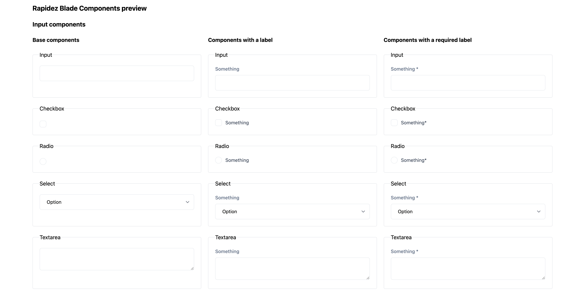
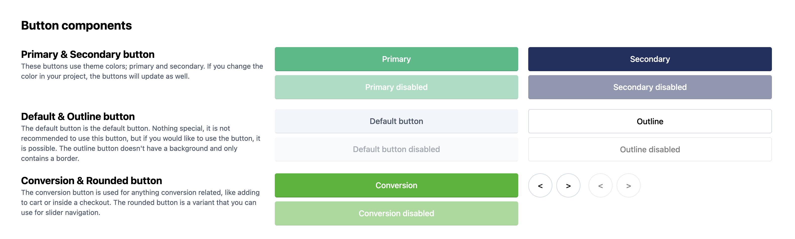

# Rapidez Blade Components

This package includes some Tailwind CSS styled Blade components, the components do not need or require Rapidez. This package is only used within Rapidez by default, but **can be used in any Laravel project**.

- [Input](https://github.com/rapidez/blade-components/blob/master/resources/views/components/input/input.blade.php)
- [Checkbox](https://github.com/rapidez/blade-components/blob/master/resources/views/components/input/checkbox/checkbox.blade.php)
- [Radio](https://github.com/rapidez/blade-components/blob/master/resources/views/components/input/radio/radio.blade.php)
- [Select](https://github.com/rapidez/blade-components/blob/master/resources/views/components/input/select/select.blade.php)
- [Textarea](https://github.com/rapidez/blade-components/blob/master/resources/views/components/input/textarea/textarea.blade.php)
- [Label](https://github.com/rapidez/blade-components/blob/master/resources/views/components/label/label.blade.php)
- [Accordion](https://github.com/rapidez/blade-components/blob/master/resources/views/components/accordion/accordion.blade.php)
- [Buttons](#buttons)
- [Prose](https://github.com/rapidez/blade-components/blob/master/resources/views/components/prose/prose.blade.php)
- [Slideover](https://github.com/rapidez/blade-components/blob/master/resources/views/components/slideover/slideover.blade.php)
- [Slideover (mobile only)](https://github.com/rapidez/blade-components/blob/master/resources/views/components/slideover/mobile.blade.php)
- [Readmore](https://github.com/rapidez/blade-components/blob/master/resources/views/components/readmore/readmore.blade.php)

The idea with these components is to have a good starting point and centralized styling. Most of the components use a [Anonymous Index](https://laravel.com/docs/master/blade#anonymous-index-components), this way you have a default and variants can be added next to it. We're using the (currently undocumented) [component name guessing](https://github.com/laravel/framework/pull/52669) here.

We don't provide a input + label combination component as you'll end up with attribute merging issues. We can't guess where the attribute should go; the input or the label. We could provide a 99% use case but you'll eventually end up with exceptions and complexity within the components. But; we do provide it for the checkbox and radio as you can see within those components. If you don't need the label you can use the `base` component as you can find within the examples.

[](https://rapidez.github.io/blade-components/demo/components.html)

<a name="buttons"></a>

The base button doesn't have any styling; here, we only use the `x-rapidez::tag`. All other buttons use the `button/button`, which contains the basic styling for buttons, such as padding, hover effects, and the disabled state. The button variants contain styling for the background and text color. There is only one exception: the `button/slider`, which has more custom styling than the other button variants.



- [Base](https://github.com/rapidez/blade-components/blob/master/resources/views/components/button/base.blade.php)
- [Default](https://github.com/rapidez/blade-components/blob/master/resources/views/components/button/button.blade.php)
- [Primary](https://github.com/rapidez/blade-components/blob/master/resources/views/components/button/primary.blade.php)
- [Secondary](https://github.com/rapidez/blade-components/blob/master/resources/views/components/button/secondary.blade.php)
- [Outline](https://github.com/rapidez/blade-components/blob/master/resources/views/components/button/outline.blade.php)
- [Conversion](https://github.com/rapidez/blade-components/blob/master/resources/views/components/button/conversion.blade.php)
- [Slider](https://github.com/rapidez/blade-components/blob/master/resources/views/components/button/slider.blade.php)


## Installation

```
composer require rapidez/blade-components
```

And include the CSS file in your `resources/css/app.css`:
```
@import '../../vendor/rapidez/blade-components/resources/css/package.css';
```

If you're not using Tailwind yet, you've to make sure you've setup Tailwind 4 with these plugins:

- [Forms](https://github.com/tailwindlabs/tailwindcss-forms)
- [Typography](https://github.com/tailwindlabs/tailwindcss-typography)

A minimal setup can be found in this repos `app.css`, `package.json` and `vite.config.js`.

More information about the usage and variables can be found in the Rapidez docs: https://docs.rapidez.io/5.x/theming.html#css

### Views

If you like to change the components you can publish the views with:
```
php artisan vendor:publish --tag=rapidez-blade-components-views
```

### Read more component

The [readmore component](https://github.com/rapidez/blade-components/blob/master/resources/views/components/readmore/readmore.blade.php) includes some Javascript, we're using a [Blade Stack](https://laravel.com/docs/master/blade#stacks) named `foot` for that. Make sure you've an `@stack('foot')` before your closing `</body>` tag. Within Rapidez this is already present within the [`layouts/app.blade.php`](https://github.com/rapidez/core/blob/master/resources/views/layouts/app.blade.php).

## Usage

Just like any other Blade component, check out the [Laravel Blade docs](https://laravel.com/docs/master/blade) and the examples within the components code linked above. All components are prefixed with `x-rapidez::` to avoid any conflicts with existing Blade components within your project.

### Basic examples

#### Input with a label

```blade
<label>
    <x-rapidez::label>Something</x-rapidez::label>
    <x-rapidez::input name="something" class="extra-styling" />
</label>
```

#### Checkbox

```blade
<x-rapidez::input.checkbox name="something">
    @lang('Translatable label')
</x-rapidez::input.checkbox>
```

#### Prose

```blade
<x-rapidez::prose>
    Content
</x-rapidez::prose>
```

#### Accordion

```blade
<x-rapidez::accordion>
    <x-slot:label>Title</x-slot:label>
    <x-slot:content>
        Collapsable content goes here
    </x-slot:content>
</x-rapidez::accordion>
```

#### Slideover
```blade
<label for="my-slideover">
    Open Slideover
</label>

<x-rapidez::slideover id="my-slideover" title="Example Slideover">
    Your slideover content goes here
</x-rapidez::slideover>
```
Make sure to add this class to your body tag to prevent scrolling when the slideover is open:
```html
<body class="has-[.prevent-scroll:checked]:overflow-clip">
```

#### Tag

It is a Blade version of a [dynamic Vue component](https://vuejs.org/guide/essentials/component-basics.html#dynamic-components)

##### Usage

```blade
<x-rapidez::tag is="span" class="font-bold">
    Something
</x-rapidez::tag>
```

which will result in

```html
<span class="font-bold">
    Something
</span>
```

## Changing components

If you like to change the components you can publish the views with:
```
php artisan vendor:publish --tag=rapidez-blade-components-views
```

## Preview

There is a preview Blade file included with all the components, to view that in your project you could register a route for it within `routes/web.php` and visit the `/components` route from your browser:

```php
Route::view('components', 'rapidez::components-preview');
```

## Development

When you're working on this package you should first install the frontend dependencies with `yarn`, create an initial build with `yarn build`, symlink the public build with `yarn symlink-public` and to show a preview in the browser use `yarn preview`.

## License

GNU General Public License v3. Please see [License File](LICENSE) for more information.
