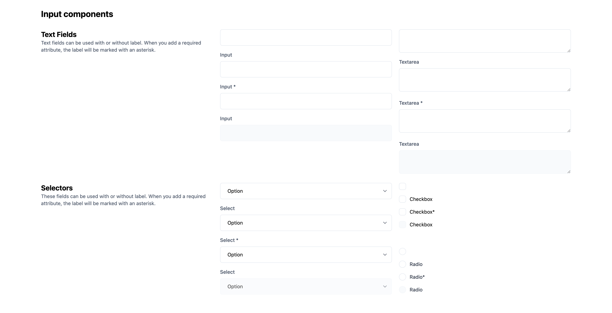

# Rapidez Blade Components

This package includes some Tailwind CSS styled Blade components, the components do not need or require Rapidez. This package is only used within Rapidez by default, but **can be used in any Laravel project**.

- [Input](https://github.com/rapidez/blade-components/blob/master/resources/views/components/input/input.blade.php)
- [Checkbox](https://github.com/rapidez/blade-components/blob/master/resources/views/components/input/checkbox/checkbox.blade.php)
- [Radio](https://github.com/rapidez/blade-components/blob/master/resources/views/components/input/radio/radio.blade.php)
- [Select](https://github.com/rapidez/blade-components/blob/master/resources/views/components/input/select/select.blade.php)
- [Textarea](https://github.com/rapidez/blade-components/blob/master/resources/views/components/input/textarea/textarea.blade.php)
- [Label](https://github.com/rapidez/blade-components/blob/master/resources/views/components/label/label.blade.php)
- [Accordion](https://github.com/rapidez/blade-components/blob/master/resources/views/components/accordion/index.blade.php)

The idea with these components is to have a good starting point and centralized styling. Most of the components use a [Anonymous Index](https://laravel.com/docs/master/blade#anonymous-index-components), this way you have a default and variants can be added next to it. We're using the (currently undocumented) [component name guessing](https://github.com/laravel/framework/pull/52669) here.

We don't provide a input + label combination component as you'll end up with attribute merging issues. We can't guess where the attribute should go; the input or the label. We could provide a 99% use case but you'll eventually end up with exceptions and complexity within the components. But; we do provide it for the checkbox and radio as you can see within those components. If you don't need the label you can use the `base` component as you can find within the examples.

[](https://rapidez.github.io/blade-components/demo/components.html)

## Installation

```
composer require rapidez/blade-components
```

And make sure these colors are present in your Tailwind config:
```js
colors: {
    neutral: '#334155',
    inactive: '#64748b',
    border: '#e7ebef',
    disabled: '#ebe8de',
}
```

### Views

If you like to change the components you can publish the views with:
```
php artisan vendor:publish --tag=rapidez-blade-components-views
```

## Usage

Just like any other Blade component, check out the [Laravel Blade docs](https://laravel.com/docs/master/blade) and the examples within the components code linked above. All components are prefixed with `x-rapidez::` to avoid any conflicts with existing Blade components within your project.

### Basic examples

#### Input with a label

```blade
<label>
    <x-rapidez::label>Something</x-rapidez::label>
    <x-rapidez::input name="something" class="extra-styling" />
</label>
```

#### Checkbox

```blade
<x-rapidez::input.checkbox name="something">
    @lang('Translatable label')
</x-rapidez::input.checkbox>
```

#### Accordion

```blade
<x-rapidez::accordion>
    <x-slot:label>Accordion Title</x-slot:label>
    <x-slot:content>
        Accordion content goes here
    </x-slot:content>
</x-rapidez::accordion>
```

## Preview

There is a preview Blade file included with all the components, to view that in your project you could register a route for it within `routes/web.php` and visit the `/components` route from your browser:

```php
Route::view('components', 'rapidez::components-preview');
```

## Development

When you're working on this package you can use `composer preview-demo` to get a preview in the browser. There is also another script: `generate-demo` which runs automatically on push.

## License

GNU General Public License v3. Please see [License File](LICENSE) for more information.
