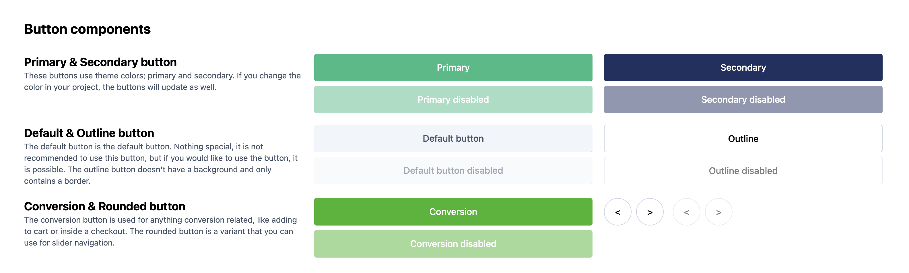

# Rapidez Blade Components

This package includes some Tailwind CSS styled Blade components, the components do not need or require Rapidez. This package is only used within Rapidez by default, but **can be used in any Laravel project**.

- [Input](https://github.com/rapidez/blade-components/blob/master/resources/views/components/input/input.blade.php)
- [Checkbox](https://github.com/rapidez/blade-components/blob/master/resources/views/components/input/checkbox/checkbox.blade.php)
- [Radio](https://github.com/rapidez/blade-components/blob/master/resources/views/components/input/radio/radio.blade.php)
- [Select](https://github.com/rapidez/blade-components/blob/master/resources/views/components/input/select/select.blade.php)
- [Textarea](https://github.com/rapidez/blade-components/blob/master/resources/views/components/input/textarea/textarea.blade.php)
- [Label](https://github.com/rapidez/blade-components/blob/master/resources/views/components/label/label.blade.php)
- [Accordion](https://github.com/rapidez/blade-components/blob/master/resources/views/components/accordion/accordion.blade.php)
- [Buttons](#buttons)

The idea with these components is to have a good starting point and centralized styling. Most of the components use a [Anonymous Index](https://laravel.com/docs/master/blade#anonymous-index-components), this way you have a default and variants can be added next to it. We're using the (currently undocumented) [component name guessing](https://github.com/laravel/framework/pull/52669) here.

We don't provide a input + label combination component as you'll end up with attribute merging issues. We can't guess where the attribute should go; the input or the label. We could provide a 99% use case but you'll eventually end up with exceptions and complexity within the components. But; we do provide it for the checkbox and radio as you can see within those components. If you don't need the label you can use the `base` component as you can find within the examples.

[](https://rapidez.github.io/blade-components/demo/components.html)

<a name="buttons"></a>

The base button doesn't have any styling; here, we only use the `x-rapidez::tag`. All other buttons use the `button/button`, which contains the basic styling for buttons, such as padding, hover effects, and the disabled state. The button variants contain styling for the background and text color. There is only one exception: the `button/slider`, which has more custom styling than the other button variants.



- [Base](https://github.com/rapidez/blade-components/blob/master/resources/views/components/button/base.blade.php)
- [Button](https://github.com/rapidez/blade-components/blob/master/resources/views/components/button/button.blade.php)
- [Primary](https://github.com/rapidez/blade-components/blob/master/resources/views/components/button/primary.blade.php)
- [Secondary](https://github.com/rapidez/blade-components/blob/master/resources/views/components/button/secondary.blade.php)
- [Outline](https://github.com/rapidez/blade-components/blob/master/resources/views/components/button/outline.blade.php)
- [Conversion](https://github.com/rapidez/blade-components/blob/master/resources/views/components/button/conversion.blade.php)
- [Slider](https://github.com/rapidez/blade-components/blob/master/resources/views/components/button/slider.blade.php)

We provide basic prose styling for text components. To apply this styling, wrap your content in the following tag:
`<x-rapidez::prose>Example text</x-rapidez::prose>`
The styles are defined in a CSS file, which you can view [here](https://github.com/rapidez/blade-components/blob/master/resources/css/components/prose.css)

In Rapidez, the prose styling is automatically imported from [app.js](https://github.com/rapidez/rapidez/blob/master/resources/js/app.js), for any another project you've to import it manually:
```
@import '../../vendor/rapidez/blade-components/resources/css/package.css';`
```


## Installation

```
composer require rapidez/blade-components
```

Make sure these colors are present in your `tailwind.config.js` file:
```js
colors: {
    colors: {
        primary: {
            DEFAULT: color('--primary', '#2FBC85'),
            text: color('--primary-text', colors.white),
        },
        secondary: {
            DEFAULT: color('--secondary', '#202F60'),
            text: color('--secondary-text', colors.white),
        },
        conversion: {
            DEFAULT: color('--conversion', '#36B422'),
            text: color('--conversion-text', colors.white),
        },
        foreground: {
            emphasis: color('--foreground-emphasis', colors.slate[900]),
            DEFAULT: color('--foreground', colors.slate[800]),
            muted: color('--foreground-muted', colors.slate[600]),
        },
        border: {
            emphasis: color('--border-emphasis', colors.slate[500]),
            DEFAULT: color('--border', colors.slate[200]),
            muted: color('--border-muted', colors.slate[100]),
        },
        background: {
            emphasis: color('--background-emphasis', colors.slate[200]),
            DEFAULT: color('--background', colors.slate[100]),
            muted: color('--background-muted', colors.slate[50]),
        },
    },
    textColor: (theme) => theme('colors.foreground'),
    borderColor: (theme) => ({
        default: theme('colors.border'),
        ...theme('colors.border'),
    }),
    backgroundColor: (theme) => theme('colors.background'),
}
```

And make sure you add this in your `tailwind.config.js` file:
```js
import colors from 'tailwindcss/colors'

function color(variable, fallback) {
    return 'color-mix(in srgb, var(' + variable + ', ' + fallback + ') calc(100% * <alpha-value>), transparent)'
}
```

### Views

If you like to change the components you can publish the views with:
```
php artisan vendor:publish --tag=rapidez-blade-components-views
```

## Usage

Just like any other Blade component, check out the [Laravel Blade docs](https://laravel.com/docs/master/blade) and the examples within the components code linked above. All components are prefixed with `x-rapidez::` to avoid any conflicts with existing Blade components within your project.

### Basic examples

#### Input with a label

```blade
<label>
    <x-rapidez::label>Something</x-rapidez::label>
    <x-rapidez::input name="something" class="extra-styling" />
</label>
```

#### Checkbox

```blade
<x-rapidez::input.checkbox name="something">
    @lang('Translatable label')
</x-rapidez::input.checkbox>
```

#### Accordion

```blade
<x-rapidez::accordion>
    <x-slot:label>Accordion Title</x-slot:label>
    <x-slot:content>
        Accordion content goes here
    </x-slot:content>
</x-rapidez::accordion>
```

#### Tag

It is a Blade version of a [dynamic Vue component](https://vuejs.org/guide/essentials/component-basics.html#dynamic-components)

##### Usage

```blade
<x-rapidez::tag is="span" class="font-bold">
    Something
</x-rapidez::tag>
```

which will result in

```html
<span class="font-bold">
    Something
</span>
```

## Preview

There is a preview Blade file included with all the components, to view that in your project you could register a route for it within `routes/web.php` and visit the `/components` route from your browser:

```php
Route::view('components', 'rapidez::components-preview');
```

## Development

When you're working on this package you can use `composer preview-demo` to get a preview in the browser. There is also another script: `generate-demo` which runs automatically on push.

## License

GNU General Public License v3. Please see [License File](LICENSE) for more information.
